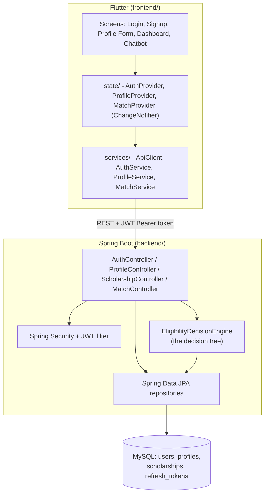

# FundFinder

FundFinder helps students find Indian scholarships they're genuinely eligible for. You
answer a few questions about your education level, income, category, state, gender, and
disability status — either through a profile form or a guided chatbot — and a rule-based
decision tree matches you against a real, seeded dataset of Indian government and private
scholarships.

## Honesty note

An earlier version of this project claimed a "Decision Tree Algorithm" for matching, but no
such algorithm actually existed in the code — only a coincidental substring match between a
few chatbot answers and free-text eligibility strings. This rebuild replaces that with a real,
traceable rule engine (see [How Matching Works](#how-matching-works)) and a real seeded
dataset, and nothing below is described as done unless it's actually implemented and runnable.

## Architecture



- **Frontend**: Flutter, calling REST APIs (no direct Firebase/Firestore access anymore).
- **Backend**: Java 17, Spring Boot, Spring Security (JWT), Spring Data JPA, MySQL, Maven.
- **Matching**: a real decision tree in `EligibilityDecisionEngine`, shared by both the
  dashboard and the guided chatbot flow — see below.

## Project structure

```
fundfinderff/
  backend/    Spring Boot API (Java 17, Maven)
  frontend/   Flutter app (calls the backend over REST)
```

## Prerequisites

- **Java 17** (Eclipse Temurin or any JDK 17 distribution)
- **MySQL 8.x Community Server**
- **Flutter SDK** (see step-by-step install below if you don't have it — no prior Flutter
  experience assumed)
- **Google Chrome** (the app runs as a Flutter *web* app during development, so no Android
  emulator or Android Studio is required)

No separate Maven install is needed — the backend includes the Maven Wrapper (`mvnw`).

---

## 1. Backend setup

### 1.1 Install and configure MySQL

If you don't already have MySQL installed, download and install **MySQL Community Server
8.x** from [dev.mysql.com](https://dev.mysql.com/downloads/mysql/) (the Windows installer
lets you set a root password during setup — remember it, you'll need it once below).

Once installed, open a terminal and connect as root:

```
mysql -u root -p
```

Then run these commands (replace `fundfinder_password` with your own password if you like —
just remember to update `backend/src/main/resources/application.yml` to match):

```sql
CREATE DATABASE fundfinder;
CREATE USER 'fundfinder_app'@'localhost' IDENTIFIED BY 'fundfinder_password';
GRANT ALL PRIVILEGES ON fundfinder.* TO 'fundfinder_app'@'localhost';
FLUSH PRIVILEGES;
```

Type `exit` to leave the MySQL prompt.

### 1.2 Run the backend

```
cd backend
./mvnw spring-boot:run
```

(On Windows PowerShell/CMD, this is `mvnw spring-boot:run` — no leading `./`.)

The first run downloads the Maven wrapper and all dependencies, so it can take a couple of
minutes. Once you see `Started FundfinderBackendApplication`, the API is live at
`http://localhost:8080`. On startup it automatically:

- Creates all database tables (via Hibernate `ddl-auto: update`)
- Seeds **18 real Indian scholarships** (see [Seeded scholarship data](#seeded-scholarship-data))
- Seeds one admin account: `admin@fundfinder.local` / `Admin@12345`

Both the seed steps are idempotent — restarting the app never duplicates data.

**Environment variables** (all optional — sensible dev defaults are baked into
`application.yml`):

| Variable | Default | Purpose |
|---|---|---|
| `DB_USERNAME` | `fundfinder_app` | MySQL username |
| `DB_PASSWORD` | `fundfinder_password` | MySQL password |
| `JWT_SECRET` | a dev-only placeholder | Signing key for access tokens — override this for anything beyond local dev |

### 1.3 Verify it's running

```
curl http://localhost:8080/api/scholarships
```

should return a JSON array of 18 scholarships.

### 1.4 Run the backend tests

```
cd backend
./mvnw test
```

This requires the local MySQL setup from step 1.1 (some tests boot the real Spring context
against it). 52 tests should pass.

---

## 2. Frontend setup (Flutter)

If you've never set up Flutter before, follow every step below in order.

### 2.1 Install the Flutter SDK

1. Go to [docs.flutter.dev/get-started/install/windows](https://docs.flutter.dev/get-started/install/windows)
   and download the latest stable Flutter SDK zip for Windows.
2. Extract the zip to a permanent location with **no spaces in the path**, e.g. `C:\src\flutter`
   (do **not** extract it into `Program Files`).
3. Add Flutter to your PATH:
   - Open Start → search "Environment Variables" → "Edit the system environment variables".
   - Click "Environment Variables...", find `Path` under "User variables", click "Edit".
   - Click "New" and add `C:\src\flutter\bin` (adjust to wherever you extracted it).
   - Click OK on all dialogs.
4. Open a **new** terminal (important — PATH changes don't apply to already-open terminals)
   and confirm it worked:
   ```
   flutter --version
   ```
5. Run Flutter's built-in doctor to check your setup:
   ```
   flutter doctor
   ```
   Since we're targeting Chrome (web) for development, you can ignore any warnings about
   Android toolchain / Xcode — those are only needed for building mobile apps, not for
   `flutter run -d chrome`. Just make sure Google Chrome is installed.

### 2.2 Get project dependencies

```
cd frontend
flutter pub get
```

### 2.3 Run the app

Make sure the backend is running first (step 1.2), then:

```
flutter run -d chrome
```

This compiles the app and opens it in a Chrome window. The first compile takes a minute or
two. By default the app talks to the backend at `http://localhost:8080` — if your backend
runs somewhere else, override it:

```
flutter run -d chrome --dart-define=API_BASE_URL=http://localhost:9090
```

### 2.4 Try it out

1. Tap **"Sign up"**, create an account.
2. Fill out the profile form ("Tell us More") — this is what the matching engine actually
   uses (Education Level, Annual Family Income, Category, Gender, State, Disability).
3. You'll land on the dashboard showing real scholarships you're eligible for, computed
   live by the backend from the profile you just entered.
4. Try the **ChatBot** tab — it asks the same questions conversationally and calls the exact
   same matching engine (see below).

### 2.5 Run the frontend tests

```
cd frontend
flutter test
```

5 widget tests should pass, covering `ScholarshipCard` rendering/navigation and login form
validation.

---

## Adding or updating scholarships

There's no admin UI by design — new/updated scholarships are managed via the admin-only
CRUD API directly (e.g. with Postman or curl), authenticated as the seeded admin account.

```
# 1. Log in as admin
curl -X POST http://localhost:8080/api/auth/login \
  -H "Content-Type: application/json" \
  -d '{"email":"admin@fundfinder.local","password":"Admin@12345"}'
# -> copy the "accessToken" from the response

# 2. Create a scholarship
curl -X POST http://localhost:8080/api/scholarships \
  -H "Authorization: Bearer <accessToken>" \
  -H "Content-Type: application/json" \
  -d '{
        "name": "Example Scholarship",
        "providerName": "Example Foundation",
        "description": "...",
        "rewardAmountText": "Rs 10,000/year",
        "officialLink": "https://example.com",
        "applicationDeadline": "2026-12-31",
        "isAlwaysOpen": false,
        "minEducationLevel": "UNDERGRADUATE",
        "maxEducationLevel": "POSTGRADUATE",
        "maxAnnualIncome": 250000,
        "requiredGender": "ANY",
        "requiresDisability": false,
        "isActive": true,
        "eligibleCategories": ["SC", "ST"],
        "eligibleStates": []
      }'
```

`eligibleCategories`/`eligibleStates` follow the convention that an **empty array means
"open to everyone"** for that criterion — you don't have to list all 28 states for a
pan-India scholarship. Trying this as a non-admin (a regular registered student) correctly
returns `403 Forbidden` — role-based access control is genuinely enforced, not just present
in name.

## Seeded scholarship data

18 real Indian government and private scholarships, researched July 2026 — National
Scholarship Portal schemes (Post-Matric SC/OBC/ST, Pre-Matric Minorities, NMMS, Central
Sector Scheme, INSPIRE, Top Class Education for Students with Disabilities, Merit-cum-Means
for Minorities), two state-specific schemes (Tamil Nadu, Maharashtra), and private trusts
(Reliance Foundation, Aditya Birla Group, Kotak Education Foundation, LIC). Real scholarship
deadlines and income ceilings change over time — treat the seed data as a realistic
illustrative snapshot, not a live feed, and update it via the CRUD API above as schemes
change.

---

## How matching works

This is the part of the project that's actually new and real. The old app's chatbot did:

```dart
// old code - a coincidental keyword match, not a real algorithm
userAnswers.any((answer) =>
    scholarship.eligibility.any((criteria) =>
        criteria.toLowerCase().contains(answer.toLowerCase())))
```

...which meant a scholarship only "matched" if one of your typed answers happened to appear
as a literal substring inside a free-text eligibility description. There was no structure to
it at all.

### The real decision tree

`EligibilityDecisionEngine` (`backend/src/main/java/com/fundfinder/matching/EligibilityDecisionEngine.java`)
takes one `MatchCriteria` (education level, annual income, category, gender, state,
disability) and checks every active scholarship against it through six sequential decision
nodes:

```
1. Education level  -> is the applicant's level within [scholarship.min, scholarship.max]?
2. Income ceiling    -> does the applicant's income exceed the scholarship's cap (if any)?
3. Category          -> is the applicant's category in the scholarship's eligible set (if restricted)?
4. State             -> is the applicant's state in the scholarship's eligible set (if restricted)?
5. Gender            -> does the required gender (if any) match the applicant's?
6. Disability        -> if required, does the applicant have it?
```

Each node is a plain `if` statement with an early `return` — that early return **is** a leaf
of the tree (either "not eligible, here's exactly why" or falls through to the next node).
It's written as straight-line code rather than a generic `Node`/`Composite` object graph on
purpose: with six fixed criteria and ~20 scholarships, a generic pluggable-rule framework
would be indirection with no real payoff, and much harder to defend line-by-line in an
interview than six honest `if` statements. If this needed to scale to dozens of
independently-pluggable criteria, the natural next step would be extracting each check into
an `EligibilityRule` and iterating a `List<EligibilityRule>` (the Strategy pattern) — that's
documented as a deliberate non-goal in the code, not an oversight.

**One engine, two entry points** — this is the part worth highlighting in an interview:

- `GET /api/match` builds `MatchCriteria` from your saved `Profile` (used by the dashboard).
- `POST /api/match/preview` builds it directly from a request body (used by the guided
  chatbot, before you've necessarily saved a profile).

Both call the exact same `EligibilityDecisionEngine.match()`. This was verified directly: the
same profile data submitted through the dashboard's profile form and through the chatbot's
guided Q&A returns **identical scholarship lists** — proof it's one engine with two front
doors, not two parallel (and potentially inconsistent) implementations.

### Design patterns — used honestly, not for a checklist

- **Builder** — `MatchCriteria` genuinely uses it: six fields, two different call sites
  constructing it, no telescoping constructor.
- **Singleton** — not hand-rolled. `EligibilityDecisionEngine` and every service/repository
  are Spring `@Service`/`@Repository` beans, which the Spring IoC container already manages
  as singletons by default.
- **Strategy** — deliberately *not* implemented today (see above) — it's a documented future
  extension point, not something forced in to list on a resume.
- **Factory / Observer** — don't genuinely fit anywhere in this codebase, so they're not used.

### Chatbot: rule-driven, not AI

The chatbot (`frontend/lib/Screens/Chatbot/`) is a guided, step-by-step Q&A that builds a
`MatchCriteria` one answer at a time, using the same enum options as the profile form, then
submits it to `POST /api/match/preview`. It is explicitly **not** natural language processing
or an AI model — every question maps directly onto one structured field, and the in-app copy
says so.

---

## API reference

| Method | Path | Auth | Description |
|---|---|---|---|
| POST | `/api/auth/register` | Public | Create an account, returns access + refresh tokens |
| POST | `/api/auth/login` | Public | Returns access + refresh tokens |
| POST | `/api/auth/refresh` | Public | Rotates a refresh token for a new access token |
| POST | `/api/auth/logout` | Public | Revokes a refresh token server-side |
| GET | `/api/auth/me` | Required | Current user's id/name/email/role |
| GET | `/api/profile` | Required | Caller's saved profile (404 if not created yet) |
| PUT | `/api/profile` | Required | Create or update the caller's profile |
| GET | `/api/scholarships` | Public | List all active scholarships |
| GET | `/api/scholarships/{id}` | Public | One scholarship |
| POST | `/api/scholarships` | Admin | Create a scholarship |
| PUT | `/api/scholarships/{id}` | Admin | Update a scholarship |
| DELETE | `/api/scholarships/{id}` | Admin | Remove a scholarship |
| GET | `/api/match` | Required | Matches from the caller's saved profile |
| POST | `/api/match/preview` | Required | Matches from criteria in the request body |

Access tokens are short-lived JWTs (15 min); refresh tokens are opaque, DB-backed, and
rotate on every use, so logout can genuinely revoke access server-side.

---

## Known limitations

Documented honestly rather than left for someone to discover:

- **Seeded data is a snapshot, not a live feed.** The 18 scholarships were researched in
  July 2026 — real deadlines and income ceilings for government schemes change periodically.
  There's no scheduled job to refresh them automatically; updates go through the admin API.
- **No admin UI.** Scholarship CRUD is Postman/curl-only by design (see
  [Adding or updating scholarships](#adding-or-updating-scholarships)).
- **No password reset flow.** The "Forgot Password" screen exists but honestly says it's not
  implemented yet, rather than being silently wired to nothing.
- **No account deletion.** Same reasoning — the button exists but says so rather than faking it.
- **Single role tier beyond student/admin.** There's no concept of, say, a scholarship-provider
  role that manages only its own listings.
- **Token storage uses `shared_preferences`**, which is fine for a college project demo but
  is not secure storage — a production app would use something like `flutter_secure_storage`.
- **Login/signup UI predates this rebuild** and is intentionally left visually as-is aside
  from a real fixed layout bug (a hard-coded card height overflowed its content at some
  viewport sizes) — polish beyond that was out of scope.
